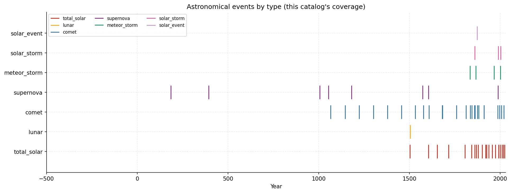
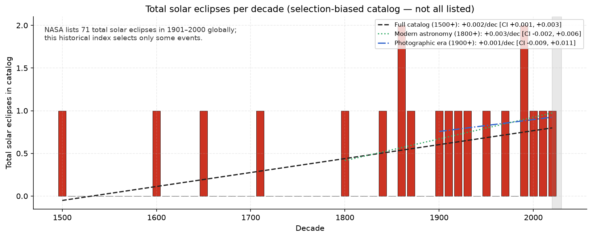
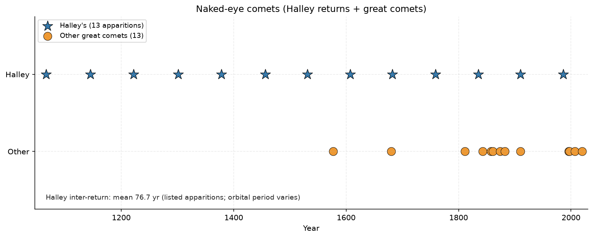
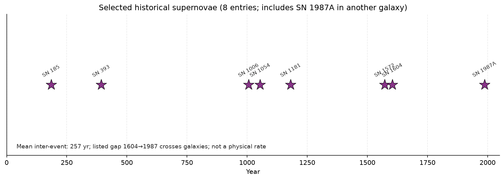

# astronomical-signs

Selected historical astronomical events plus a separately versioned NASA eclipse monitor. The repository supports the [correlations research hub](https://github.com/Biblejustin/correlations). Biblical references provide thematic context; these data do not establish prophetic fulfillment or causation.

`eclipses.csv` remains the original selected historical index. It combines solar/lunar eclipses, comets, supernovae, meteor storms and solar storms. Selection criteria and historical detection differ across classes. Its counts must not be treated as a complete eclipse census or a uniform astronomical event rate.

## Corrections to the historical interpretation

NASA lists **71 total solar eclipses during 1901–2000**, alongside other solar eclipse types. The earlier claim of about 24 total solar eclipses per century was incorrect. Counts vary across century intervals; local visibility differs from global occurrence. A regression through selected entries cannot identify a physical eclipse-rate trend. [NASA twentieth-century catalog](https://eclipse.gsfc.nasa.gov/SEcat5/SE1901-2000.html), [NASA catalog index](https://eclipse.gsfc.nasa.gov/SEcat5/SEcatalog.html).

The supernova entries mix galaxies and optical discovery histories. **SN 1987A occurred in the Large Magellanic Cloud**, outside the Milky Way. The 383-year interval between 1604 and 1987 therefore is not a Milky Way waiting time. Nor is it the longest interval among this file’s entries. Missing optical reports do not imply no explosions: NASA’s Chandra observations identified a young Milky Way remnant whose original explosion was obscured by gas and dust. An average occurrence rate does not make the next event “overdue.” [NASA SN 1987A](https://www.nasa.gov/image-article/sn-87a/), [Chandra G1.9+0.3 discovery](https://chandra.harvard.edu/photo/2008/g19/).

Eclipse predictions follow celestial mechanics within stated ephemeris and Earth-rotation uncertainties. Predictability does not establish that any statistical association must be terrestrial events responding to an eclipse. Chance, common time patterns, selection and reporting remain alternative explanations; causal interpretation requires separate evidence. [NASA prediction uncertainties](https://eclipse.gsfc.nasa.gov/SEhelp/uncertainty2004.html).

## Selected historical plots

The plots below describe inclusion in `eclipses.csv`. Descriptive fits and gaps characterize this selected index; they do not estimate complete occurrence rates. Supernova entries and bright-comet entries are not claimed to exhaust all events visible to the naked eye. Listed Halley apparitions also do not imply an invariant orbital period.









The historical CSV columns remain `date`, `type`, `region_visible` and `notes_significance`. Some entries have only a year; historical notes are context, not uniform quantitative visibility measurements. Catalog gaps must remain distinguished from verified absence.

## Reproducing historical plots

```bash
python3 -m venv .venv
.venv/bin/pip install pandas numpy matplotlib
.venv/bin/python make_plots.py
```

Historical compilation references include NASA eclipse catalogs; Kronk’s *Cometography*; Stephenson and Green’s *Historical Supernovae and Their Remnants*; and McKinley’s *Meteor Science and Engineering*. These broad references do not supply uniform row-level provenance for the selected index.

## NASA eclipse monitor

[Current report](data/eclipses/report.md) includes the next Jerusalem-visible events, model altitude and above-horizon phase duration. The complete catalog contains **454 solar and 459 lunar events during 1900–2100**. All global event types remain present, including events invisible from Jerusalem and future predictions.

The fixed location is NASA’s Jerusalem city point: **31°46′N, 35°14′E, elevation 808.9 m**. It represents one location, not an all-Israel visibility footprint. Source horizon conventions exclude terrain, buildings, clouds and visual contrast. Penumbral geometry does not promise naked-eye detection. See the [frozen plan](eclipse_plan.json) for exact conventions and limits.

**Times are modeled UT1**, obtained from source TD minus source ΔT. They are not exact leap-second-aware UTC. Every contact has its own Gregorian date across midnight. Original source ephemerides and ΔT predictions are retained; future timing carries model uncertainty. Past catalog entries remain model predictions, not verified sighting records.

The [validation report](data/eclipses/validation.json) checks complete catalog identity/type/count coverage, interval bounds and independent NASA references. The Jerusalem solar reference is the published 2006 March 29 local table. Lunar references cover 2015 September 28, 2006 September 7 and 2020 January 10 contact times and qualitative visibility maps. These are independent published checks, not independent physical models. Solar elements contain no categorical global type: global P/A/T/H remain pinned catalog fields with unique greatest-TD identity joins. Independent element/global categorical-type agreement applies to lunar eclipses only. Lunar altitude has no independent numeric validation here. Frozen tolerances never expand to accommodate results.

### Daily offline replay

Use **Python 3.13** and **Node 26.8.1** (`.python-version`, `.nvmrc`). The monitor rejects Python older than 3.11 and any different Node version. It needs no Python package beyond the standard library.

```bash
python3.13 monitor_eclipses.py --offline
# Reproduce a particular report date:
python3.13 monitor_eclipses.py --offline --as-of 2026-09-06
```

Daily replay verifies pinned raw inputs/code and regenerates only `data/eclipses/`. Original `eclipses.csv`, source archives, vendor code and the plan remain unchanged. A failed catalog/model/reference check preserves the last successful export; diagnostic failure details go to `data/diagnostics/`.

Live source checks are a separate review step:

```bash
python3.13 monitor_eclipses.py --check-sources
```

This downloads candidates to ignored `.cache/eclipse-source-candidates/`, recording source URL and old/new hashes. It never activates new source data or code. Changed/failed sources return exit status 2 for review. Updating pinned inputs requires an explicit reviewed revision and rerunning frozen validation; keep earlier raw objects and revision manifests.

### Exports and provenance

| File under `data/eclipses/` | Meaning |
|---|---|
| `global_catalog.csv` | Every global event, raw NASA type code plus normalized type, catalog identity, source line/hash, TD/ΔT/UT1 and global durations |
| `jerusalem_events.csv` | One row per global event; local geometry/type, horizon-visible interval, altitude, solar magnitude/obscuration and phase durations |
| `jerusalem_contacts.csv` | Every applicable local contact, its full UT1 date, source altitude and horizon flag; absent phases stay absent |
| `annual_counts.csv` | All 201 years × seven global type classes, with explicit global denominators and Jerusalem visibility counts; current/future model years labeled |
| `validation.json` | Frozen reference checks, per-event bounds and remaining validation limits |
| `monitor.json` | Location/time/model metadata, current source/code bindings and hashes/byte lengths of the six companion exports |
| `report.md` | Readable coverage, caveats and upcoming events |

Files are staged and validated before individual replacements. `monitor.json` is replaced last. **Consumers must verify all six companion hashes and byte lengths before trusting a snapshot**; interruption during replacement can temporarily leave files inconsistent, which those checks detect. No multi-file filesystem transaction is claimed.

Original bytes reside in [sources/nasa](sources/nasa), addressed by SHA256. [Manifest](sources/nasa/manifest.json) records URLs, first-fetch timestamps, available publication timestamps and hashes; [source pins](source_pins.json) bind inputs, frozen plan, reference fixtures and the unchanged historical CSV. Initial method-research download timestamps were retained from successful download file times. Publication dates are not inferred when unavailable.

NASA programs retain their GPL version 2-or-later license and attribution in [vendor/nasa](vendor/nasa). The adapter reuses those programs, with no installed ephemeris package. Detailed public source documentation: [solar model](https://eclipse.gsfc.nasa.gov/JSEX/JSEX-key.html), [lunar model](https://eclipse.gsfc.nasa.gov/JLEX/JLEX-key.html).

### Tests

```bash
python3.13 -m pip install -r requirements-dev.txt
python3.13 -m pytest tests/test_eclipse_monitor.py -q
```

Tests run offline against retained NASA inputs and temporary output directories. GitHub fixture CI uses Python 3.13, Node 26.8.1, read-only repository permission and a `Biblejustin` owner gate; it does not fetch NASA, commit or push.
